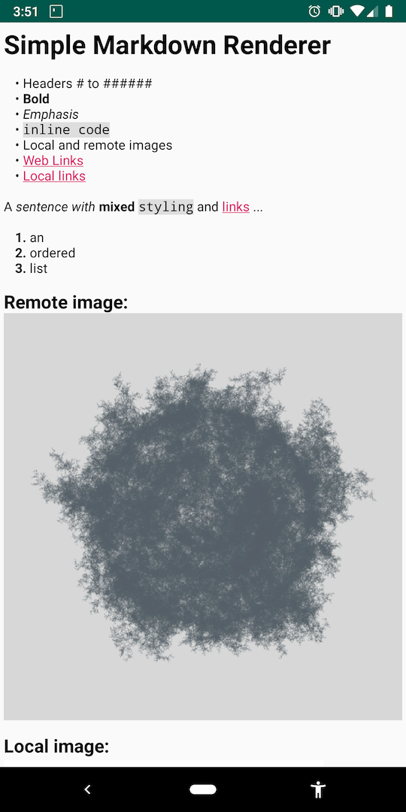

# Merkja for Android

A very simple single class Markdown renderer for when you only need the basic syntax and don't want to add a 3rd-party dependency. Warning: Contains hacky regex and span mangling, I have no idea how unoptimised it is. There is no error checking and if you pass anything other than really simple markdown it _will_ break.

It's not meant to be a replacement for a full-featured library, if you need full Markdown support use [Markwon](https://github.com/noties/Markwon)

This isn't a library, just copy the [Merkja](https://github.com/fiskurgit/Merkja/blob/master/app/src/main/java/fiskurgit/android/markdownrenderer/Merkja.kt) class to your project.




## Simple

```kotlin
text_view.text = markdownString
Merkja(text_view).render()
```

## Handling Links and Images

```kotlin
text_view.text = markdownString

val merkja = Merkja(text_view) { matchEvent ->

    when (matchEvent.schemeType){
        Merkja.SCHEME_IMAGE -> loadImage(matchEvent)
        Merkja.SCHEME_LINK -> handleLink(matchEvent)
    }
}
merkja.render()

...

fun loadImage(matchEvent: MatchEvent){
    val imageUrl = matchEvent.value
    //fetch image async then:
    runOnUiThread {
        merkja.insertImage(bitmap, matchEvent)
    }
}

```

---

## Supported

* Big headers down to small headers
* **Bold**
* _italics_
* `inline code`
* Local images
* Async remote images
* Local and remote links (websites and local markdown files)
* Ordered and unordered lists
* ```code blocks ```
* Quotes

## Coming Soon

* Horizontal rule

## Not Supported

* Variants for the supported tags above
* Probably something you want to use (use [Markwon](https://github.com/noties/Markwon) instead)
